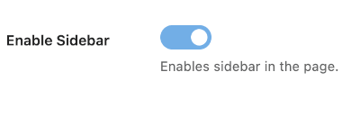

# CMB2 Toggle

CMB2 toggle field for CMB2 Metabox for WordPress.

## Screenshot:



## Installation
You can install it as a plugin, or include the main file into your theme or plugin folder.

## Usage:

```php
add_action( 'cmb2_admin_init', 'theme_slug_create_custom_metabox' );

function theme_slug_create_custom_metabox() {
  $prefix = '_theme_slug_';

  $cmb2_metabox = new_cmb2_box(
    array(
      'id'           => $prefix . 'sidebar_settings',
      'title'        => esc_html__( 'Sidebar Settings', 'theme-slug' ),
      'object_types' => array( 'page' ),
      'priority'     => 'high',
      'context'      => 'normal',
    )
  );

  $cmb2_metabox->add_field(
    array(
      'name'    => esc_html__( 'Enable Sidebar', 'theme-slug' ),
      'id'      => $prefix . 'enable_sidebar',
      'desc'    => esc_html__( 'Enables sidebar in the page.', 'text-domain' ),
      'type'    => 'toggle',
      'default' => 'on', // If it is checked by default.
    )
  );
}
```

* Example usage of the toggle field:

```php
$enable_sidebar = get_post_meta( $post->ID, '_theme_slug_enable_sidebar', true );

if ( 'on' === $enable_sidebar ){
  // Do something when it is checked;
}
```

## Follow Us

* [Website](https://themevan.com/)
* [Twitter](https://twitter.com/themevan/)
